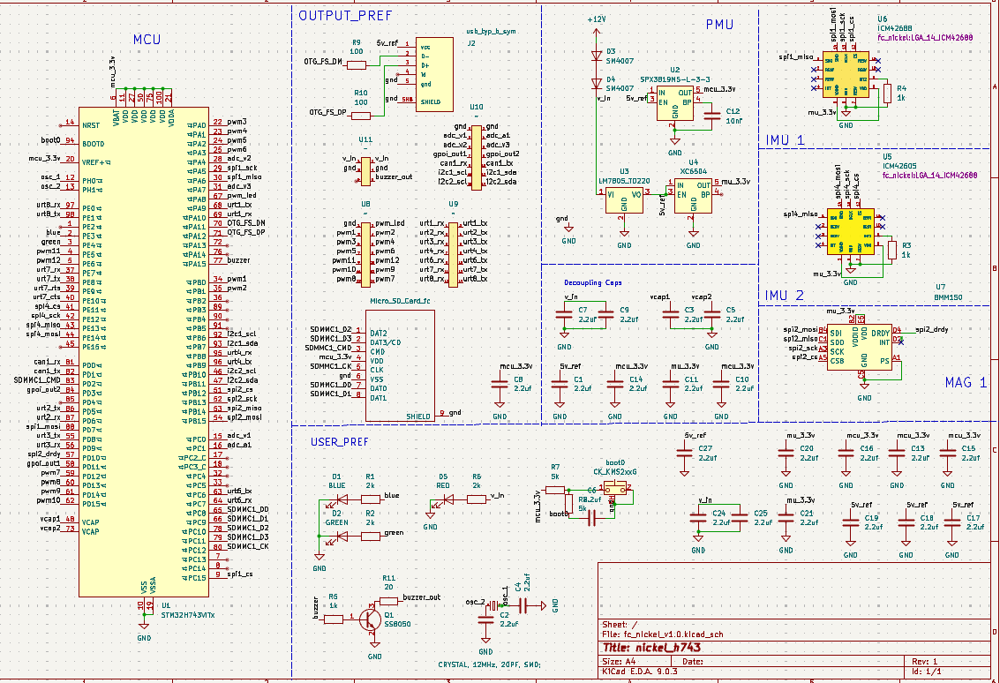
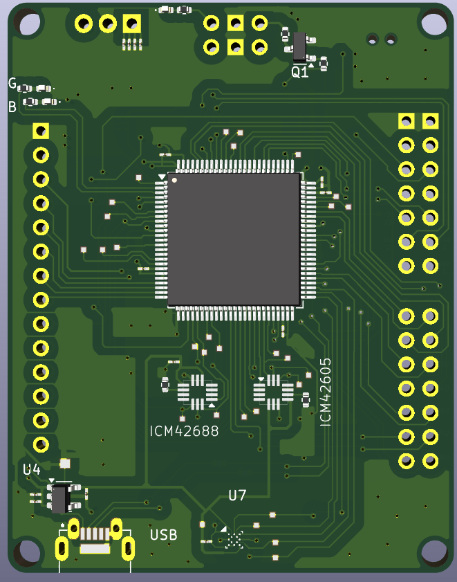
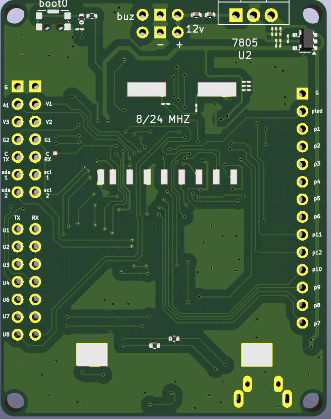

# CUSTOM FlightController-H743
The repo contains flight controller target files, PCB Gerber files, and the schematic.


## FC notes 
Nickel-H473 is based on MAMBAH743_V4 FC

However custom pin can be used unless their usage is not compromised , STM programmer IDE can be a great help in case assigning pins.

## FIRMWARE SETUP 

ARDUPILOT : **https://github.com/ArduPilot/ardupilot**

Target Files :`libraries/AP_HAL_ChibiOS/hwdef/`

Environment setup : https://ardupilot.org/dev/docs/building-the-code.html

Build cmd :
```bash
./waf distclean
./Tools/scripts/build_bootloaders.py Nickel407       # Builds bootloader (outputs to Tools/bootloaders/)
./waf configure --board FlyingMoon407
./waf plane
```
bin/hex file are stored in build directory
             
It is recommended to go through ardupilot documentation First

## Target Files 

There are two primary target files ` hwdef-bl.dat (responsible for building bootloader)  
                                        hwdef.dat (for main firmware)`

Checkout this HW files for reference example :   https://github.com/ArduPilot/ardupilot/tree/master/libraries/AP_HAL_ChibiOS/hwdef/fmuv3

### For pin mapping use STM programmer IDE 

## Schematic & PCB 
Check schematic folder  
The pcb is 2 layer 47 * 60 mm  

<p align="center">
  
</p>

<p align="center">
  
  
</p>

